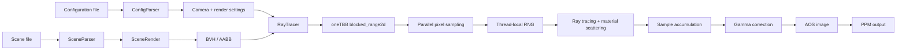

# Parallel Ray Tracer

A high-performance **C++23 ray tracer** focused on algorithmic optimization, multithreaded rendering, reproducible benchmarking, and energy-aware performance analysis.

The renderer supports configurable scenes composed of spheres and cylinders, multiple material models, recursive light transport, anti-aliasing, gamma correction, BVH acceleration, and parallel image generation with **Intel oneTBB**.

Developed at **Universidad Carlos III de Madrid (UC3M)** as a Computer Architecture project by:

- **Alejandro de Santos Lobo**
- **Alejandro Pérez Montes**
- **Roberto Sanz Gamero**
- **Daniel Robles Ruiz**


## Project origin

This repository is a cleaned and portfolio-oriented version of a university team project originally developed as part of the Computer Architecture course at Universidad Carlos III de Madrid.

The original work was developed collaboratively by Alejandro de Santos Lobo, Alejandro Pérez Montes, Roberto Sanz Gamero, and Daniel Robles Ruiz.

I republished the project in a new repository to preserve the final implementation in a cleaner, self-contained form, improve documentation and reproducibility, and continue maintaining it as part of my personal portfolio.

This re-publication is shared with **the permission of the other original team members**.

The original authorship and individual contributions are documented below.


## Highlights

- Ray tracing engine written in **modern C++23**.
- **BVH (Bounding Volume Hierarchy)** and **AABB** acceleration to reduce unnecessary primitive intersection tests.
- Parallel rendering with **Intel oneTBB** using `blocked_range2d`.
- Configurable thread count, partitioner and grain size.
- Thread-local pseudo-random number generators for safe and reproducible multithreaded rendering.
- Matte, metallic and refractive materials.
- Sphere and cylinder intersection support.
- Multi-sample anti-aliasing and configurable ray depth.
- PPM image generation with gamma correction.
- Automated unit and functional testing.
- Strict compilation flags and optional **clang-tidy** static analysis.
- Reproducible development environment through a VS Code Dev Container.
- Extensive performance and energy benchmarking carried out on university compute infrastructure.
  

## How the renderer works

At a high level, the renderer follows the pipeline below:



The renderer consumes two text-based input files:

- a **configuration file**, which defines camera parameters, image settings, sampling depth, random seeds, and background colors;
- a **scene file**, which defines materials and geometric primitives such as spheres and cylinders.

Both inputs are parsed and validated before rendering begins. The scene is then converted into a lightweight render-oriented representation and organized into a **BVH (Bounding Volume Hierarchy)** built from **AABB (Axis-Aligned Bounding Box)** volumes, reducing the number of unnecessary primitive intersection tests.

The `RayTracer` renders the image in parallel using **Intel oneTBB** and a two-dimensional `blocked_range2d` decomposition. Each worker samples pixels independently and uses a thread-local random number generator to avoid race conditions while preserving reproducibility.

For every sample, a ray is generated from the camera and traced through the BVH. When an intersection occurs, the material determines how the ray is scattered, reflected, or refracted. This process continues recursively until the ray escapes the scene or reaches the configured maximum depth.

The resulting samples are averaged per pixel, gamma correction is applied, and the final RGB values are stored in an **AOS (Array of Structures)** image buffer before being exported as a **PPM** image.

## Scene representation

The renderer currently supports two geometric primitives:

- **Spheres**
- **Cylinders**

Each primitive implements the intersection logic required by the ray tracer and exposes an **axis-aligned bounding box (AABB)** used during BVH construction. This allows groups of primitives to be discarded early when a ray does not intersect their enclosing volume, reducing unnecessary intersection tests.

### Materials

Three material models are implemented:

- **Matte** — diffuse scattering using randomized outgoing directions.
- **Metal** — specular reflection with a configurable fuzz factor.
- **Refractive** — refraction based on the material's refractive index, including total internal reflection.

The material system is deliberately separated into two representations. Parser-side objects retain the metadata and validation logic required when loading scene files, while lightweight render-side objects contain only the state and operations needed during ray tracing.

This separation keeps input-processing concerns out of the performance-critical rendering path and improves data locality by avoiding unnecessary parser-related state during repeated intersection and scattering operations.


## Camera and ray generation

The camera is fully configurable through:

- position;
- target point;
- north/up direction;
- field of view;
- image resolution;
- random seed.

From these parameters, the camera derives the projection geometry used to map image pixels into the 3D scene, including the viewport orientation, horizontal and vertical basis vectors, and the position of each pixel on the projection plane.

To reduce aliasing, each pixel is sampled multiple times using small randomized offsets within its area. For every sample, the renderer generates a primary ray from the camera position through the corresponding point on the projection plane.

The resulting sample colors are accumulated and averaged per pixel before gamma correction is applied and the final RGB value is written to the output image.

## Ray tracing

For each sampled ray, the renderer repeatedly:

1. searches for the nearest scene intersection;
2. evaluates the material at that intersection;
3. generates the next reflected or refracted ray;
4. accumulates material attenuation;
5. stops when the ray leaves the scene or reaches the configured maximum depth.

If a ray does not intersect the scene, its final contribution is calculated from a configurable background gradient.


## BVH acceleration

A major optimization in the project is the **Bounding Volume Hierarchy**.

Instead of testing every ray against every object in the scene, primitives are organized recursively into a binary hierarchy of bounding boxes. Each `BvhNode` owns an `AABB` that encloses the geometry below it.

When a ray misses a node's bounding box, the entire subtree can be discarded immediately. This significantly reduces the number of expensive sphere and cylinder intersection calculations for complex scenes.

The BVH is built once before rendering and is then traversed for every ray-scene query.


## Parallel rendering with Intel oneTBB

The most expensive operation in the renderer is the per-pixel ray-tracing loop. Pixels are independent from each other, making this stage a natural target for data parallelism.

The final implementation divides the image as a two-dimensional range using:

```cpp
tbb::blocked_range2d<std::size_t>
```

and executes tiles with `tbb::parallel_for`.

Three oneTBB partitioning strategies are supported:

| ID | Partitioner | Description |
|---:|---|---|
| `0` | `AUTO` | Lets oneTBB choose how work is subdivided dynamically. |
| `1` | `STATIC` | Assigns fixed work partitions. |
| `2` | `SIMPLE` | Recursively divides work according to the requested grain size and permits work stealing. |

The executable also allows the maximum number of worker threads and the 2D grain size to be configured at runtime.

### Default parallel configuration

The benchmarked default configuration is:

- **256 threads**
- **simple partitioner**
- **1×1 grain size**
- **2D blocked range**

These defaults were selected after evaluating execution time, energy consumption and Energy-Delay Product on the project's benchmark workload. They are workload- and hardware-dependent, so the executable exposes all three parameters for experimentation.


## Thread-safe random number generation

Parallel rendering introduces a concurrency challenge around pseudo-random number generation. Sharing a single mutable generator between worker threads would require synchronization and could otherwise introduce data races.

To avoid shared mutable RNG state in the rendering hot path, the renderer uses an `RNGPool` abstraction backed by **thread-local `std::mt19937_64` generators**.

For each configured master seed, `RNGPool` first derives a set of per-thread seeds using `std::mt19937_64`. Worker threads are assigned an internal ID on first use through an atomic counter, and that ID is used to select the seed that initializes the thread-local generator.

The renderer uses random values in two main parts of the pipeline:

- **primary-ray sampling**, where random offsets in the range `[-0.5, 0.5]` are applied inside each pixel for anti-aliasing;
- **material scattering**, where random values are used to generate diffuse and perturbed reflection directions.

Because each worker accesses a thread-local generator, random-number generation does not require locks during rendering, avoiding synchronization overhead in one of the most frequently executed parts of the ray-tracing pipeline.

The random streams are derived from the configurable `ray_rng_seed` and `material_rng_seed` values, allowing seed-controlled executions while keeping random-number generation compatible with multithreaded rendering.


## Image representation

During the initial implementation, two alternative in-memory image layouts were developed and evaluated:

- **AOS — Array of Structures**, where each pixel stores its RGB components together;
- **SOA — Structure of Arrays**, where the red, green and blue channels are stored in separate arrays.

Both representations were benchmarked in terms of execution time and energy consumption. The measurements showed only marginal differences between them.

This is mainly because pixel storage is not the dominant cost of the renderer. Most of the execution time is spent tracing rays, computing geometric intersections, evaluating material interactions and recursively propagating secondary rays. As a result, changing the memory layout of the final image buffer had little impact on overall performance.

When the renderer was later parallelized, the **AOS representation** was retained as the single image layout used by the final executable. This simplified the parallel implementation without sacrificing meaningful performance.

Each AOS pixel stores its red, green and blue components together, and the completed image is exported using the ASCII **PPM P3** format.


## Performance engineering

Performance optimization was approached at multiple levels, rather than relying solely on multithreading.

### Render-specific data structures

Parser-side objects, which contain validation logic and additional metadata, are converted into lighter render-oriented representations before entering the rendering pipeline.

These render-side objects retain only the state and operations required during ray tracing, reducing unnecessary data in the hot path and improving cache locality.

### Mathematical simplification

Frequently executed intersection routines were optimized to reduce expensive operations such as repeated vector normalization and square-root computation.

Where possible, intermediate results are reused and invariant values are precomputed before entering performance-critical loops.

### Reduced dynamic dispatch

The original intersection path was reorganized to reduce virtual function calls inside heavily repeated loops.

Separating critical geometry operations and using more direct calls lowers dispatch overhead in code that may execute millions of times during a render.

### Inlining of hot operations

Small and frequently executed vector, geometry and intersection operations were moved into header files and made suitable for compiler inlining.

This reduces function-call overhead in the most frequently executed parts of the rendering pipeline.

### Compiler optimization

Release builds use aggressive compiler optimization flags:

```text
-O3 -march=native
```


## Performance results

The project was benchmarked on university compute infrastructure using execution-time and energy measurements.

During sequential optimization, one representative rendering workload was reduced from approximately **180 s to 59 s** through source-level and compiler optimizations.

After introducing BVH acceleration and parallel rendering, the tested parallel workload scaled from roughly **55 s with one thread** to approximately **2.31 s** in the best measured configuration, corresponding to a speedup of around **23×**.

For the grain-size study, the best measured configuration used a **1×1 grain**, with approximately:

- **2.31 s execution time**
- **681.5 J energy consumption**

The experiments also showed that scaling is strongest up to roughly 16–32 threads and progressively saturates at higher thread counts. The 2D decomposition consistently retained better scaling at high parallelism than the tested one-dimensional alternatives.

> Benchmark results depend on hardware, scene complexity, image resolution and rendering parameters. The figures above correspond to the university benchmark environment used during development.


## Build environment

The recommended way to build the project is through the provided **VS Code Dev Container**, which supplies the required compiler and development tools.

Main technologies:

- C++23
- GCC 14
- CMake
- Ninja Multi-Config
- Intel oneTBB
- GoogleTest
- Microsoft GSL
- clang-tidy / clang-format
- Python 3 for functional-test automation

GoogleTest and Microsoft GSL are fetched automatically by CMake.

### Build with the Dev Container

Open the repository in VS Code and run:

```text
Dev Containers: Reopen in Container
```

Then configure and build the Release version:

```bash
cmake --preset default
cmake --build --preset gcc-release
```

The executable will be generated at:

```text
out/build/default/par/Release/render-par
```

### Build with clang-tidy enabled

```bash
cmake --preset clang-tidy
cmake --build --preset clang-tidy-release
```


## Running the renderer

Usage:

```text
render-par <config> <scene> <output> [threads] [partitioner] [grain]
```

The first three arguments are mandatory.

Optional arguments:

| Argument | Meaning | Default |
|---|---|---:|
| `threads` | Maximum oneTBB worker threads | `256` |
| `partitioner` | `0=AUTO`, `1=STATIC`, `2=SIMPLE` | `2` |
| `grain` | Tile grain size in each image dimension | `1` |

Example:

```bash
./out/build/default/par/Release/render-par \
  examples/01-background/config.txt \
  examples/01-background/scene.txt \
  output.ppm
```

Equivalent explicit invocation with the default parallel settings:

```bash
./out/build/default/par/Release/render-par \
  examples/01-background/config.txt \
  examples/01-background/scene.txt \
  output.ppm \
  256 2 1
```

---

## Testing

The project contains both unit and end-to-end functional tests.

### Unit tests

Unit tests use **GoogleTest** and cover core modules such as:

- vector math;
- colors;
- camera calculations;
- configuration parsing;
- scene parsing;
- ray tracing;
- scene rendering;
- collision information;
- material scattering;
- image handling.

After configuring the default build, run:

```bash
bash utcommon/utest.sh
```

The script builds and runs both Debug and Release test configurations through CTest.

### Functional tests

The `ftest/` suite treats the renderer as a black box and validates complete execution from input parsing to image generation.

The current repository contains valid rendering cases and invalid-input cases covering malformed configurations, unknown entities, duplicate materials and undefined material references.

Run them with:

```bash
python3 ftest/ftest.py
```

For valid cases, generated images are compared against reference outputs using per-pixel and RMSE tolerances. Invalid cases verify exit codes, absence of an output image and expected error messages.


## Project structure

```text
.
├── .devcontainer/       # Reproducible development environment
├── cmake/               # CMake testing / coverage helpers
├── common/              # Core ray tracing, parsing, geometry, materials and BVH
├── examples/            # Ready-to-run example scenes
├── ftest/               # Functional test suite
├── par/                 # Parallel executable and AOS image implementation
├── partest/             # Parallel performance / energy experiment scripts
├── utcommon/            # GoogleTest unit tests
├── CMakeLists.txt
├── CMakePresets.json
└── README.md
```


## Daniel Robles Ruiz — contributions

This was a collaborative four-person project. My work focused primarily on the **application architecture, rendering foundations, system integration, performance optimization and parallel execution infrastructure**.

### Application entry points and rendering orchestration

I implemented the **main application flow for both the AOS and SOA renderers**, connecting the different subsystems required to transform input files into a rendered image.

This included coordinating:

- configuration and scene loading;
- camera initialization;
- renderer setup;
- image representation selection;
- execution of the rendering pipeline;
- output generation and error propagation.

The application entry points acted as the integration layer between independently developed components, ensuring that the complete renderer could be executed consistently from the command line.

For the parallel version, I also contributed to adapting the project configuration and execution flow to support the new multithreaded renderer and its parallel runtime dependencies.

### Camera and mathematical foundations

I implemented several core components used throughout the rendering pipeline:

- the **camera subsystem**, responsible for deriving the projection geometry and viewpoint used to generate primary rays;
- the project's **vector abstraction and vector operations**, used throughout camera calculations, ray directions, surface normals and geometric computations;
- the **collision-information structure** used to propagate intersection data through the ray-tracing pipeline;
- the background **color interpolation** used to generate the scene gradient.

These components are used repeatedly during rendering and form part of the mathematical foundation of the ray tracer.

### Integration, debugging and correctness

A significant part of my work involved **integrating independently developed modules and debugging the complete renderer**.

I helped resolve discrepancies between generated images and the expected reference outputs, including numerically sensitive behavior in the rendering pipeline. This integration work was particularly important because small differences in random sampling, vector calculations or material behavior could produce measurable differences in the generated images.

I also contributed extensively to the **unit-test suite** and participated in maintaining the codebase under the project's strict `clang-tidy` configuration.

### Performance optimization

I co-developed the optimization work performed after obtaining a correct baseline implementation.

This involved analyzing performance-critical execution paths, removing unnecessary computation and refining the renderer's hot path. These optimizations contributed to reducing the execution time of a representative sequential workload from roughly **180 seconds to about 59 seconds** before parallelization.

The optimization process also helped identify which parts of the renderer dominated execution time, providing the basis for the later parallelization strategy.

### Parallel rendering infrastructure

For the parallel renderer, I worked on several central concurrency and infrastructure components:

- configured the **CMake and Docker development environment** required for the parallel implementation;
- designed and implemented the **RNGPool** mechanism used to provide thread-local pseudo-random number generation and avoid races around shared RNG state;
- identified the per-pixel rendering loop as the primary parallelization target;
- implemented the first parallel version of the renderer using **Intel oneTBB `parallel_for`**;
- contributed to testing different thread counts and parallel execution configurations;
- helped clean and validate the multithreaded implementation under `clang-tidy`.

This work established the initial parallel execution model on top of which the later scheduling and partitioning experiments were built.

### Benchmarking and performance analysis

I also contributed to the experimental evaluation of the renderer on university compute infrastructure.

My work included:

- running parallel performance experiments;
- helping evaluate different thread counts and execution configurations;
- creating benchmark visualizations;
- analyzing execution-time and energy-consumption results;
- studying scalability and the relationship between performance and energy usage.

This allowed implementation decisions to be evaluated using measured behavior on real multicore hardware rather than relying only on theoretical expectations.

## Authors

- Alejandro de Santos Lobo
- Alejandro Pérez Montes
- Roberto Sanz Gamero
- Daniel Robles Ruiz

Developed for the **Computer Architecture** course at **Universidad Carlos III de Madrid**.